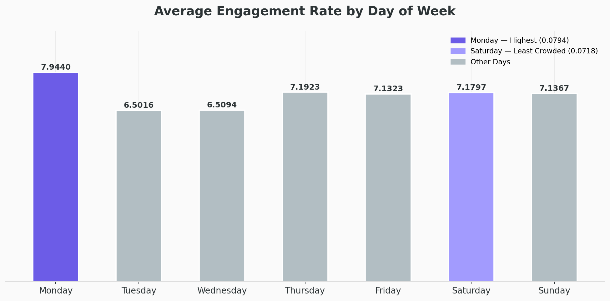
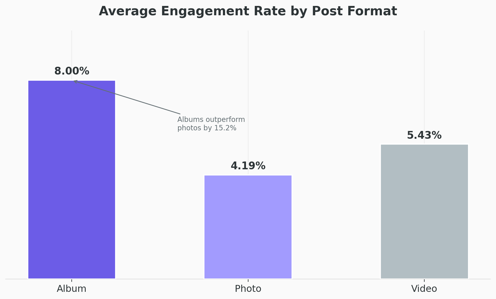
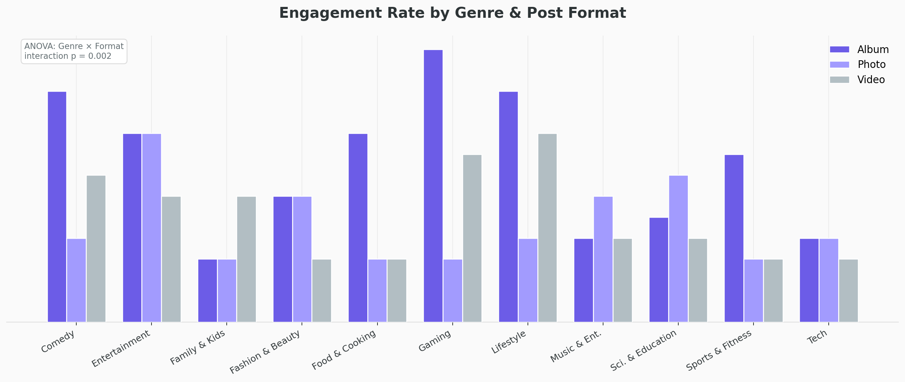

# Instagram Engagement Analytics — Marketing Analytics Competition 2026

Data-driven analysis of Instagram engagement across 5,975 posts from 47 top creators using OLS regression and Python-based caption text feature extraction.

🏆 *Milestone Achiever Award & Finalist — Fordham Gabelli Marketing Analytics Competition 2026*

---

**Objective:** Identify the content, format, and caption characteristics that drive engagement rate among top Instagram creators, and translate findings into actionable recommendations for content strategy.

## Key Findings

- **Post format is the single most actionable lever.** Album posts outperform single photos by 15.2% (coef=+0.0103, p<0.001). Videos underperform photos by 65% (coef=-0.0459, p<0.001).

- **Creator identity dominates engagement.** Adding creator fixed effects increased R-squared from 0.163 to 0.618 — 45% of engagement variation is explained by *who* the creator is, not what they post.

- **Longer captions correlate with higher engagement** within a creator's own posting history (coef=1.655e-05, p<0.001), likely reflecting more personal, story-driven content.

- **Tags hurt engagement.** Posts containing @ mentions are negatively associated with engagement (coef=-0.0076, p<0.001), consistent with audience disengagement from sponsored or collaborative content.

- **Engagement declined platform-wide in 2023.** A year-over-year drop of 0.018 engagement rate points (p<0.001) confirms platform-level algorithm changes during this period.

---

## Key Insight Visualizations

### Engagement Rate by Day of Week

### Post Format vs. Average Engagement Rate

### Genre × Format Interaction

### Residual Plot — Heteroscedasticity

---

## Overview

This project was submitted as part of the Fordham University Gabelli School of Business Marketing Analytics Competition 2026, April 2026.

The dataset consists of 5,975 Instagram posts from 47 top creators published between January 2022 and December 2023. Creators spanned 11 genres including Gaming, Fashion & Beauty, Lifestyle, Sports & Fitness, and Entertainment, with follower counts ranging from 158,000 to 68 million.

The central research question: **What are the drivers of online engagement, and how can content creators boost it?**

Four dimensions were examined: caption text features, post format, content genre, and posting day of week.

**KPI:** Engagement Rate = (Likes + Comments) / Followers at Time of Posting

Raw metrics like likes and comments were rejected as primary outcomes due to their dependence on audience size. Engagement rate normalizes for this effect, enabling meaningful comparison across creators of all sizes.

---

## Business Problem

Instagram creators and brand managers face a common challenge: distinguishing between content choices that genuinely move engagement and those that are simply correlated with creator popularity.

Key questions addressed:

- Which post formats drive the highest engagement across creators and genres?  
- Do caption characteristics — hashtags, sentiment, CTAs, length — meaningfully affect performance?  
- What role does posting day play, and is it actionable?  
- How did platform-wide algorithm changes affect engagement from 2022 to 2023?

---

## Exploratory Analysis Highlights

**Posting Day**
Monday produced the highest average engagement rate at 0.0794. Tuesday and Wednesday performed worst at ~0.065. Saturday had 18% fewer posts than Monday but achieved a nearly equivalent engagement rate of 0.0718 — suggesting reduced competition translates to greater visibility per post.

**Hashtag Usage**
Posts with 6–10 hashtags achieved the highest mean engagement at 11.55%. Posts with more than 10 hashtags dropped sharply to 3.84%, and posts with no hashtags averaged 6.76%. Moderate, targeted hashtag usage outperforms both extremes.

**Post Format**
Album posts achieved a mean engagement rate of 8.00%, compared to 5.43% for videos and 4.19% for single photos. This pattern held consistently across creators and genres.

**Call-to-Action**
Posts containing a CTA averaged 9.25% engagement vs. 6.81% without — a 35.8% difference in raw descriptive terms. This effect disappeared after controlling for creator identity in the regression.

**Genre**
An ANOVA test confirmed the genre effect is statistically significant (F=64.77, p<0.001). Gaming and Fashion & Beauty achieved the highest average engagement rates.

---

## Analytical Approach

### Caption Text Feature Extraction

Seven quantitative features were extracted from each post's caption using Python:

| Feature | Description |
|---|---|
| `caption_length` | Total character count |
| `hashtag_count` | Number of hashtags |
| `emoji_count` | Number of emojis |
| `has_cta` | Binary: contains CTA phrase (e.g. "comment," "tag," "link in bio") |
| `has_question` | Binary: contains a question mark |
| `sentiment` | VADER compound score (–1 to +1) |
| `has_tag` | Binary: caption contains an @ mention |

### OLS Regression Model

An OLS regression model predicted engagement rate from caption text features while controlling for:

- **Creator fixed effects** — 46 binary dummy variables to account for baseline engagement differences across individual creators
- **Post format** — album and video dummies with photo as the baseline
- **Year** — 2022 vs. 2023 to capture platform-level shifts

Genre was excluded due to severe multicollinearity with creator fixed effects (condition number: 1.15e+16). Removing genre reduced the condition number to 2.26e+04 while leaving R-squared unchanged at 0.617, confirming creator fixed effects already captured genre-level variation.

### Heteroscedasticity Correction

A residual plot revealed a cone-shaped pattern, violating the OLS assumption of constant error variance. HC3 robust standard errors were applied. Nine creators shifted from insignificant to significant post-correction, confirming the original model underestimated consistency among high-follower accounts.

### Multicollinearity Diagnostics

VIF scores were calculated for all text features and control variables. All values fell below 2, well under the conventional threshold of 4, confirming no problematic multicollinearity among predictors of interest.

---

## Model Results

| Variable | Coefficient | p-value | Significant? |
|---|---|---|---|
| Caption Length | 1.655e-05 | 0.004 | ✅ |
| Has Tag (@mention) | -0.0076 | 0.002 | ✅ |
| Is Album | +0.0103 | <0.001 | ✅ |
| Is Video | -0.0459 | <0.001 | ✅ |
| Is 2023 | -0.0182 | <0.001 | ✅ |
| Hashtag Count | — | n.s. | ❌ |
| Emoji Count | — | n.s. | ❌ |
| CTA Presence | — | n.s. | ❌ |
| Question Presence | — | n.s. | ❌ |
| Sentiment (VADER) | — | n.s. | ❌ |

**R-squared: 0.618 | Observations: 5,975**

---

## Key Insights & Recommendations

**Post albums over photos and videos.**  
Carousels significantly outperform both formats. This is the single most impactful format decision a creator can make, with a statistically significant 0.011 engagement rate point premium over photos.

**Write with authenticity.**  
Longer captions correlate with higher engagement within a creator's own posting history — likely signaling more personal, story-driven content rather than promotional copy.

**Avoid excessive tagging.**  
@ mentions are negatively associated with engagement, suggesting audiences disengage from visibly sponsored or collaborative posts.

**Don't overthink CTAs, sentiment, or emojis.**  
These showed no significant effect once creator identity was controlled for. Time is better spent on format and caption depth.

**Benchmark against yourself, not the platform.**  
Engagement declined platform-wide in 2023. Creators should track performance against their own historical averages and consider cross-platform diversification to reduce algorithm dependence.

---

## Limitations

**Creator identity dominance:** 45% of engagement variation is explained by who the creator is, not what they post. Content decisions matter less than the audience trust a creator has built over time.

**Top creator sample bias:** The dataset covers 47 top creators only. Findings may not generalize to smaller or emerging accounts where content choices likely play a larger relative role.

**Correlation, not causation:** This is an observational study. Significant associations do not confirm that content choices directly cause higher engagement.

---

## Repository Structure

**Root**
- `Text_Analysis.ipynb` — Main analysis notebook (caption feature extraction + OLS regression)
- `README.md` — Project overview and documentation

**data/**
- `Marketing_Analytics_Competition_2026_Dataset.xlsx` — Raw dataset (5,975 posts, 47 creators)

**images/**
- `engagement_by_day.png`
- `post_format_engagement.png`
- `genre_format_interaction.png`
- `residual_plot.png`

---

## Tools Used

Python · Pandas · Statsmodels · NLTK / VADER · Matplotlib · Google Colab

---

## Team

Chris Remmell · Anushka Verma · Winnie Huang · Ariana Idrizaj  
MS Marketing Intelligence — Fordham University, Gabelli School of Business  
Marketing Analytics Competition 2026
